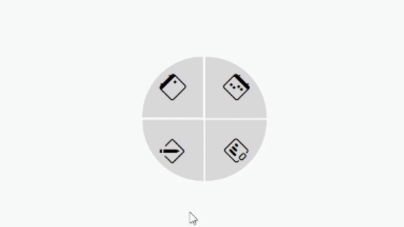

# Menu Circular Interativo

Este projeto implementa um menu circular interativo utilizando HTML, CSS e JavaScript. O design moderno e responsivo é ideal para sites e aplicativos web que desejam oferecer uma navegação estilosa e funcional.

## Demonstração



## Funcionalidades

- Menu circular com quatro itens interativos.
- Botão central para expandir e recolher o menu.
- Ícones representativos de funcionalidades, usando Bootstrap Icons.
- Animações suaves ao interagir com os itens do menu.

## Estrutura do Projeto

- **HTML**: Define a estrutura básica do menu.
- **CSS**: Estiliza o menu, criando a disposição circular e as animações.
- **JavaScript**: Adiciona a interatividade, permitindo a expansão e recolhimento do menu.

## Como Utilizar

1. Clone o repositório:
    ```bash
    git clone https://github.com/izaq-code/circle-menu
    ```

2. Navegue até o diretório do projeto:
    ```bash
    cd circle-menu
    ```

3. Abra o arquivo `index.html` no seu navegador para ver o menu em ação.
